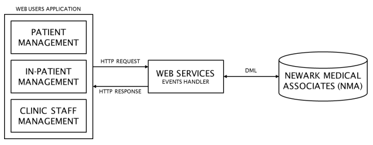

[Back to Assignment Phases](0-AssignmentPhases.md)

# Application Requirements

You are required to develop 3 Web-based applications Newark Medical Associates as shown in the figure below.

The applications should minimally cover:

* Patient management
    * Insert a new patient
    * View patient information
    * Schedule an appointment with a Doctor
    * Check previous diagnoses and illnesses
    * View scheduled per doctor and per day

* In-patient management
    * Check for available room/bed
    * Assign/remove a patent to a room/bed
    * Assign/remove a doctor to a patient
    * Assign/remove a nurse to a patient
    * View scheduled surgery per room and per day 
    * View scheduled surgery per surgeon and per day 
    * Book a surgery 
    * View scheduled surgery per patient

* Medical staff management
    * Add/remove a stuff member
    * View staff member per job type
    * Schedule job shift